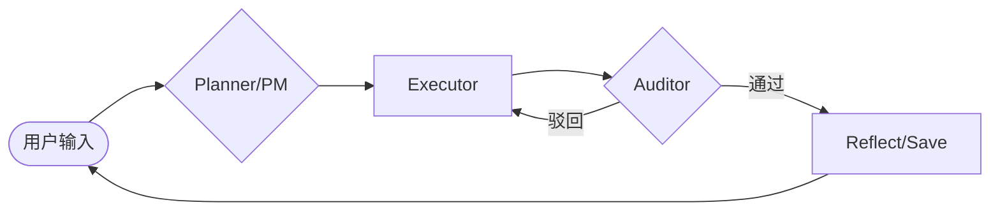

# Tars Agent 2.0 (MCP Edition)

Tars Agent 是一个基于 Python 构建的高性能、工业级 AI 智能体。它全面采用了 Anthropic 的 **Model Context Protocol (MCP)** 标准，实现了高度解耦、物理隔离且具备自进化能力的插件化架构。

## 🏗️ 2.0 架构 (LangGraph + MCP)

Tars 2.0 采用了 **THP (Tars Harness Protocol)** 协议，通过 **LangGraph** 驱动任务流转：



- **LangGraph**: 核心逻辑骨架，负责状态流转与节点调度。
- **MCP (Model Context Protocol)**: 工具层的统一协议，支持 Docker 沙箱化运行。
- **LiteLLM**: 多模型适配层，支持 OpenAI, Claude, Gemini, DeepSeek 等主流 LLM。
- **`/app/mcp`**: 核心调度中心 (`client_manager.py`)，负责 Server 发现与 JSON-RPC 通信。
- **`/mcp_servers`**: 技能插槽目录。每个子文件夹都是一个独立的 MCP 服务。
    - **`system_runtime`**: 提供文件读写、终端、记忆等核心能力 (Native 运行)。
    - **`crypto_market`**: 提供实时行情聚合 (Docker 沙箱运行)。
    - **`web_search`**: 提供联网搜索能力 (Docker 沙箱运行)。

- **懒加载 (Lazy Loading)**: 启动时仅扫描元数据。只有当你明确调用某个工具时，Tars 才会启动对应的 Docker 容器或进程，实现“零延迟启动”。
- **物理隔离沙盒**: 第三方扩展默认运行在 Docker 容器中，确保你的宿主机环境安全。
- **环境自愈与持久化**: 容器内自动安装依赖，并利用 Docker Volume 持久化 Python 环境，避免重复安装。

## 🚀 快速开始

### 1. 环境准备
- Docker & Docker Compose
- Python 3.10+

### 2. 配置与启动
1. 复制 `env_example` 并配置 `.env`（需包含 `OPENAI_API_KEY` 和 `TAVILY_API_KEY` 等）。
2. python3 -m venv .venv
3. source .venv/bin/activate
4. 启动数据库：`docker-compose up -d db`。
5. 运行 Tars：
   ```bash
   pip install -r requirements.txt
   ./tars
   ```

## 📖 相关文档
- [WALKTHROUGH.md](./walkthrough.md): 记录了从 Legacy 到 MCP 的详细演变。
- [MCP_GUIDE.md](./MCP_GUIDE.md): 开发者指南，教你如何为 Tars 编写新的 MCP Server。
- [docs/HARNESS_ENGINEERING.md](./docs/HARNESS_ENGINEERING.md): THP 2.0 约束协议、节点不变量和 L6 自愈沙箱技术规范。
- [docs/SAFETY_AND_HITL.md](./docs/SAFETY_AND_HITL.md): 双重纵深防御与人机协同(HITL)机制。
- [docs/METABASE_TRACE_DASHBOARD.md](./docs/METABASE_TRACE_DASHBOARD.md): Trace DB 化后的 Metabase 看板配置指南。
- [docs/TIERED_REASONING.md](./docs/TIERED_REASONING.md): 仿生算力分级（Tiered Reasoning）配置与路由规范。
- [docs/EVAL_GATE.md](./docs/EVAL_GATE.md): 评测集回归门禁与 CI 接入说明。
- [CHANGELOG.md](./CHANGELOG.md): 版本变更历史。

## 🔎 可观测性回放
- 运行后会在 `logs/traces-YYYY-MM-DD.jsonl` 中记录结构化追踪事件（含 `trace_id`）。
- 可通过 `.env` 调整追踪与审计行为：
  - `TRACE_TOOL_PREVIEW_CHARS`：工具结果预览长度（默认 280）
  - `AUDITOR_L1_FAST_PATH_ENABLED`：是否启用单步 L1 快速审计（默认 `true`）
  - `TRACE_SINK_MODE`：追踪写入目标（`jsonl` / `db` / `both`，默认 `both`）
- 使用回放脚本按 `trace_id` 复盘：
  ```bash
  python3 scripts/replay_trace.py <trace_id>
  ```
  或指定来源：
  ```bash
  python3 scripts/replay_trace.py <trace_id> --source db
  python3 scripts/replay_trace.py <trace_id> --source auto
  ```

## 📊 Metabase 查询
- Phase 2 已支持将 trace 双写到 PostgreSQL（`TRACE_SINK_MODE=both`）。
- 初始化/更新 Metabase 查询视图：
  ```bash
  python3 scripts/apply_metabase_views.py
  ```
- 主要视图：
  - `vw_trace_runs_summary`：运行摘要（状态、耗时、响应长度）
  - `vw_trace_event_timeline`：事件时间线
  - `vw_trace_llm_usage`：LLM token 消耗
  - `vw_trace_tool_calls`：工具调用统计与结果预览
  - `vw_trace_hitl_decisions`：HITL 决策统计
  - `vw_trace_auditor_verdicts`：审计通过/驳回分析
  - `vw_trace_tier_transitions`：Tier 升降级行为分析

## 🧠 Tiered Reasoning
- 使用 `.env` 配置 `TIER_MODEL_LOW/MID/HIGH/ULTRA` 与角色默认层级。
- 启用开关：`TIER_ROUTING_ENABLED=true`
- Executor 支持 `L1~L6` 覆盖映射：`TIER_EXECUTOR_L1 ... TIER_EXECUTOR_L6`
- 可设置自适应阈值与预算：`TIER_MAX_RETRIES_BEFORE_UPGRADE`、`TIER_BUDGET_TOKENS_PER_RUN`
- 连接容错可配置：`MODEL_FALLBACK_NAME`、`LLM_MAX_RETRIES`、`LLM_RETRY_BASE_DELAY_MS`

## ✅ Eval Gate
- 运行回归门禁：
  ```bash
  python3 scripts/run_eval_gate.py --source auto
  ```
- 评测报告输出到：
  - `evals/reports/eval_report_<timestamp>.json`
  - `evals/reports/latest.json`

---
*Stay Human. Stay Tars.*
