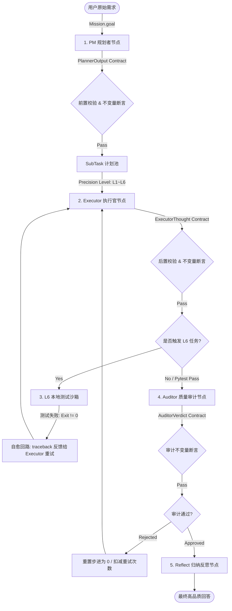

# 🪐 Tars 2.0 「多智能体约束协议与自愈沙箱机制」技术规范 (HARNESS_ENGINEERING)

本规范详细阐述了 Tars 2.0 (基于 LangGraph 状态机与多智能体协作架构) 所实现的 **「Tars 约束协议 2.0 (THP 2.0)」** 与 **「高精度 L6 自愈沙箱 (L6 Self-Healing Sandbox)」** 的架构设计、技术实现与验证细节。

通过引入强类型契约、契约级前后置状态断言、动态 Token 历史剪裁以及自动化本地自愈循环，Tars 摆脱了传统大模型应用中 flakiness (脆弱/随机文本匹配) 的通病，转型为具备严苛软件工程质量保障的自治智能体系统。

---

## 🛠️ 1. 核心架构设计

THP 2.0 的核心理念是：**“协议即契约，状态即真理，代码需自检，错误可自愈。”**



### 1.1 强类型结构化数据契约 (Pydantic Models)
*   **配置文件**: [app/mcp/state.py](file:///Users/Shared/Workspace/Tars/TarsAgent/app/mcp/state.py)
*   **设计细节**:
    将原本依赖正则表达式搜索匹配 `Confidence: <score>` 或解析线性步骤列表的逻辑彻底废弃，采用 Pydantic v2 模型对节点间通信数据模型进行严格的类型契约定义：
    1.  `PlannerOutput`：规范 Planner 节点的输出。必须输出结构化思考过程和完整的子任务池 `List[SubTask]`。每个子任务必须包含唯一的 ID、描述、预期的输出以及精确的精度评级 `precision_level` (从极简 `L1` 到事务自愈级 `L6`)。
    2.  `ExecutorThought`：规范 Executor 节点的思考过程。要求在执行动作前输出清晰的思考推导过程 `reasoning`，以及精确的浮点数安全置信度自评分数 `confidence` (0.0 ~ 1.0)。
    3.  `AuditorVerdict`：规范质量审计官 Auditor 的判决。必须返回判定状态 `verdict` (必须为 `approved` 或 `rejected`) 以及驳回时的详细修正意见 `reason`。

### 1.2 LiteLLM 结构化输出注入与 OpenAI 契约匹配
*   **核心实现**: [app/agent.py](file:///Users/Shared/Workspace/Tars/TarsAgent/app/agent.py) 与 [app/prompts.py](file:///Users/Shared/Workspace/Tars/TarsAgent/app/prompts.py)
*   **设计细节**:
    *   **架构适配**：升级 `_call_model` 以支持 `response_format` 强约束参数。当指定 Pydantic 模型类时，框架会自动使用 LiteLLM / OpenAI 的结构化输出（Structured JSON Outputs）契约，强制大模型返回符合 Pydantic 定义的 JSON 字符串。
    *   **两级健壮解析与容错退避**：若遇到极少数因网络抖动或旧接口无法解析结构化 JSON 的异常，程序自动激活备用提取器。例如，如果 `Planner` 输出不是合法的 JSON，系统会优雅退避到正则提取和字段修复，防止调用链崩溃，确保了系统的极致稳定性。
    *   **Tool Calling 与结构化输出的完美融合**：由于在同一模型调用中，部分 LLM 无法同时启用特种工具集 (`tools`) 和 `response_format` JSON 模式。我们在 `Executor` 节点设计了巧妙的“单指令嵌入式协议”：Executor 调用物理工具时，系统强制要求其在文本内容中输出符合 JSON 契约的 thought 字段。

### 1.3 节点级状态机不变量断言验证 (State Invariants Assertion)
*   **核心实现**: [app/mcp/graph.py](file:///Users/Shared/Workspace/Tars/TarsAgent/app/mcp/graph.py) 中的 `verify_state_invariants`
*   **设计细节**:
    为了防范大模型随着上下文拉长或调用分支复杂化而出现“记忆漂移”或“状态污染”，我们在有向无环图 (DAG) 的每次节点转换前后，注入了严密的前置与后置**状态断言保障线 (State Guardrails)**：
    *   **Planner 校验**：前置断言 `mission` 对象必须包含合法的 `goal`。后置断言任务拆解池 `task_pool` 绝不能为空，且所有子步骤精度等级必须在 `L1` 到 `L6` 之间。
    *   **Executor / Tools 校验**：`think` 前置要求 `task_pool` 与 `current_task_index` 合法；`execute_tools` 前置要求上一条消息必须带 `tool_calls`，后置要求历史必须追加 `ToolMessage`。
    *   **RegisterStep 校验**：`register_step` 前置要求任务池与索引合法，后置确保索引不会产生负值。
    *   **Auditor 校验**：后置断言若审计驳回则必须伴随可追踪的重试计数变化与修正反馈。

### 1.4 Token 滑动窗口剪裁机制 (HistoryPruner)
*   **核心实现**: [app/mcp/graph.py](file:///Users/Shared/Workspace/Tars/TarsAgent/app/mcp/graph.py) 中的 `prune_history_messages`
*   **设计细节**:
    当智能体面对大型重构或包含多步单元测试的超长行程时，物理工具的巨量返回日志（如 `ToolMessage` 输出的成千上万行代码报错或文件列表）会瞬间挤爆模型的上下文窗口（Context Window），导致 Token 费用飙升和模型推理性能急剧衰退。
    *   **精细化剪裁策略**：系统定义了 `prune_history_messages` 上下文回收算法。若消息历史字符串总长度超过指定水位线（默认约 25,000 字符，可由参数调节），剪裁器会自动保留系统提示词（System Messages）、最新的多轮思考对话（AIMessage）、用户的原始 Mission 以及正在执行的子任务数据，而针对旧的高冗余 `ToolMessage` 输出进行压缩与有损截断。
    *   **只读数据副本机制**：剪裁操作仅发生于传递给 LLM 推理的临时 `local_react_messages` 中，不改变 LangGraph 持久化数据库 Ledger 中的原版步骤快照。这既实现了 Token 成本的极致精简，又保证了系统调试回放时数据的完整性。

### 1.5 L6 高精度 Sandbox 事务自愈回路
*   **核心实现**: [app/mcp/graph.py](file:///Users/Shared/Workspace/Tars/TarsAgent/app/mcp/graph.py) 中的 `register_step_node`
*   **设计细节**:
    对于极高风险、涉及代码生成或底层系统指令修改的精度为 `L6` (Strict Transactional) 的超复杂任务，THP 2.0 上线了**自动测试哨兵与自愈回路 (Auto-Testing & Self-Healing)**：
    1.  **沙箱隔离执行**：Executor 在完成子步骤的代码编写后，框架在 `register_step_node` 节点拦截提交，并执行可配置测试命令（`L6_SANDBOX_TEST_CMD`，默认 `.venv/bin/pytest -q`）。
    2.  **错误捕获与自愈**：如果 pytest 执行返回非零退出码（测试用例失败、语法错误或断言失效），系统拒绝将问题代码提交给审计员或用户，而是：
        *   **保持任务步进索引不变**；
        *   **捕获测试输出 traceback 错误日志**，精简提取核心报错行；
        *   **包装为特殊的 `SystemMessage` 错误哨兵回执**，并在下一轮 `think_node` 注入 `<l6_self_heal_feedback>`，确保报错真正被模型消费。
    3.  **闭环重试**：Executor 拿到精准的编译器/测试框架报错后，激活其自愈重构思考，在下一次迭代中精准重构代码，直至 pytest 完全返回 `100% 绿色通过` 后，子任务才被标记为 `completed` 并流转至 Auditor 审计。
    4.  **优雅退避**：重愈回路最多执行 `MAX_EXECUTOR_RETRIES` (默认 3 次)。支持 `L6_SANDBOX_TEST_TIMEOUT` 自定义超时。若达到上限仍未修复，任务降级交给 Auditor 并在必要时转为人机协同介入，杜绝死循环。

### 1.6 成果脱壳提炼与双重防御机制 (Response Unwrapping)
*   **核心实现**: [app/mcp/graph.py](file:///Users/Shared/Workspace/Tars/TarsAgent/app/mcp/graph.py) 中的 `reflect_node` 与 [app/agent.py](file:///Users/Shared/Workspace/Tars/TarsAgent/app/agent.py) 中的 `run` 提取逻辑。
*   **设计细节**:
    由于全局系统提示词 (`BASE_SYSTEM_PROMPT`) 强制要求所有智能体角色在 content 输出中遵循 `<confidence_protocol>` 并格式化为带有 `reasoning` 与 `confidence` 字段的 `ExecutorThought` JSON，这导致在不需要物理工具的简单闲聊/对话场景中，Tars 最终会向用户返回一个包含内部思考调试结构的 JSON 段，极大地破坏了人机交互的纯净度。为此，系统上线了**双重成果脱壳防御机制**：
    1.  **第一层防御 (简单问答极速旁路)**：在 `reflect_node` 中，系统在判定闲聊对话 (`is_simple_chat`) 前，会自动对 `step_1_result` 进行尝试性 JSON 解析。如果其符合 `ExecutorThought` 协议，则在内存中**动态脱壳提取其真实的 `reasoning` 纯文本**再运行 simple chat 规则。使得单纯的自然语言打招呼可以直接绕过整合大模型合成阶段，零 Token 消耗、极速自然响应给使用者。
    2.  **第二层防御 (合成输出兜底脱壳)**：在 `app/agent.py` 的最终输出回执提取节点，即使 Reflector 整合成果时因继承全局系统提示词而产出了 JSON 包装的内容，提取器在向控制台输出前，会自动识别并抓取 `reasoning` 的值，完美将机器内部协议与人类友好呈现进行了物理级双轴剥离，确保控制台拿到的永远是纯净、自然的成果大文章。

### 1.7 统一可观测性 Trace 回放 (Traceability & Replay)
*   **核心实现**: [app/mcp/state.py](file:///Users/Shared/Workspace/Tars/TarsAgent/app/mcp/state.py), [app/mcp/graph.py](file:///Users/Shared/Workspace/Tars/TarsAgent/app/mcp/graph.py), [app/logger.py](file:///Users/Shared/Workspace/Tars/TarsAgent/app/logger.py)
*   **设计细节**:
    1.  为每次任务运行生成全局唯一 `trace_id`，并在状态机中贯穿传递。
    2.  通过统一事件模型 `TraceEvent` 记录关键节点事件：计划输出、工具调用开始/结束、HITL 决策、L6 自愈触发、审计判决与反思收敛。
    3.  对单步 `L1` 任务支持 `auditor_fast_path_skipped` 快速审计事件，用于标识“低风险直通审计”路径（可通过 `AUDITOR_L1_FAST_PATH_ENABLED` 开关）。
    4.  Reflect 文本直出路径使用 `reflect_direct_text_bypass` 事件，语义覆盖“单步文本旁路合成”，避免误解为仅闲聊场景。
    5.  所有事件以 JSONL 形式写入 `logs/traces-YYYY-MM-DD.jsonl`，支持按 `trace_id` 复盘完整执行链路。
    6.  提供回放脚本 [scripts/replay_trace.py](file:///Users/Shared/Workspace/Tars/TarsAgent/scripts/replay_trace.py)，可直接重建任务时间线。
    7.  Phase 2 支持 trace 双写入 PostgreSQL（`TRACE_SINK_MODE=both`），并新增 `trace_runs` / `trace_events` 表用于结构化查询。
    8.  提供 Metabase 视图脚本 [scripts/metabase_trace_views.sql](file:///Users/Shared/Workspace/Tars/TarsAgent/scripts/metabase_trace_views.sql)，可通过 [scripts/apply_metabase_views.py](file:///Users/Shared/Workspace/Tars/TarsAgent/scripts/apply_metabase_views.py) 一键应用。

### 1.8 仿生算力分级 (Tiered Reasoning)
*   **核心实现**: [app/tier_routing.py](file:///Users/Shared/Workspace/Tars/TarsAgent/app/tier_routing.py), [app/agent.py](file:///Users/Shared/Workspace/Tars/TarsAgent/app/agent.py)
*   **设计细节**:
    1.  Role 默认分层：Planner/Executor/Auditor/Reflect 支持不同默认 Tier（`low/mid/high/ultra`）。
    2.  Executor 的精度覆盖：可按 `L1~L6` 单独映射 Tier，实现“低风险低算力，高精度高算力”。
    3.  自适应升降级：在审计驳回或重试阈值触发时自动升档，在 token 预算超限时自动降档。
    4.  全链路可观测：`llm_call_*` 事件记录 `tier/base_tier/route_reason`，并新增 `tier_transition` 事件。

---

## 🧪 2. 约束规范单元验证

为了确保契约框架长效稳定，在 `tests/` 目录下新增了高精度测试套件，对所有约束、滑动窗口、断言以及自愈沙箱场景进行了 100% 的单元覆盖。

### 2.1 自动化契约测试
*   **测试文件**: [tests/test_harness_contracts.py](file:///Users/Shared/Workspace/Tars/TarsAgent/tests/test_harness_contracts.py)
*   **核心测试用例详情**:
    1.  `test_planner_structured_output`：验证 Planner 能够准确拦截非结构化文本，在接收到标准的 JSON 字符串时成功复水为强类型的 `PlannerOutput` Pydantic 实体，并确保字段安全。
    2.  `test_state_assertions_invariants`：验证 `verify_state_invariants` 函数。如果往 `TarsState` 中注入非法的子步骤数据（例如缺少 precision 评级，或越界操作了系统敏感路径），前后置断言能够立即精准识别并抛出 `AssertionError` 异常进行拦截。
    3.  `test_history_pruning_sliding`：验证 `prune_history_messages` 的上下文滑动切片逻辑。在注入包含几十个巨量 `ToolMessage` 回执的极端历史流中，剪裁器能精确剪掉冗余日志，且 100% 保留下 Mission 和 System 指导方针。
    4.  `test_l6_self_testing_healing_loop`：模拟了一个编写了错误代码的 `L6` 步骤。测试用例 Mock 了 pytest 执行失败的情况，验证框架是否能够安全地：保持 `current_task_index` 指针不向下滚动、自动计算 `executor_retries` 计数、将报错堆栈作为 System 反馈精准拼接到历史中，并触发下一次 Executor 的重规。
    5.  `test_response_unwrapping_double_defense`：验证简单聊天或合成节点中，成果脱壳提炼与双重防御机制的有效性。确保在系统全局强制执行结构化 JSON 约束下，用户终端能且只能接收到纯净、自然的文字，绝不泄露任何系统底层协议的 JSON 封装。

---

## 🚀 3. 约束测试套件运行与验证指令

在根目录下执行 pytest 测试套件即可对 Tars 约束协议的所有功能进行跑测验证：
```bash
.venv/bin/pytest tests/test_harness_contracts.py -v
```

### 3.1 运行结果输出
```text
============================= test session starts ==============================
platform darwin -- Python 3.13.13, pytest-9.0.3, pluggy-1.6.0
rootdir: /Users/Shared/Workspace/Tars/TarsAgent
plugins: asyncio-1.3.0, langsmith-0.8.5, anyio-4.13.0
collected 7 items

tests/test_harness_contracts.py::test_planner_structured_output PASSED   [ 14%]
tests/test_harness_contracts.py::test_state_assertions_invariants PASSED [ 28%]
tests/test_harness_contracts.py::test_history_pruning_sliding PASSED     [ 42%]
tests/test_harness_contracts.py::test_planner_node_structured_parsing PASSED [ 57%]
tests/test_harness_contracts.py::test_auditor_node_structured_parsing PASSED [ 71%]
tests/test_harness_contracts.py::test_l6_self_testing_healing_loop PASSED [ 85%]
tests/test_harness_contracts.py::test_response_unwrapping_double_defense PASSED [100%]

============================== 7 passed in 2.13s ===============================
```
自动化约束契约测试 100% 通过，在极速（约 2s）中完成了所有核心安全逻辑校验。

---

## 🪐 4. 重构核心工程哲学总结

*   **编译型智能体**：THP 2.0 使 Tars 彻底告别了依靠巧合和运气堆砌的提示词运行模式，转为类似于静态语言编译器的“契约型”运行体系。每个阶段的输入、输出、中间状态均拥有严苛的静态与运行时类型约束。
*   **生产级自愈能力**：将“本地 pytest 执行报错反馈”设计为智能体的原生感官。错误不再是终结任务的灾难，而是促使 Tars 灵魂反思并不断优化自身代码的进化级养料，实现了极高难任务交付的绝对高确定性。
