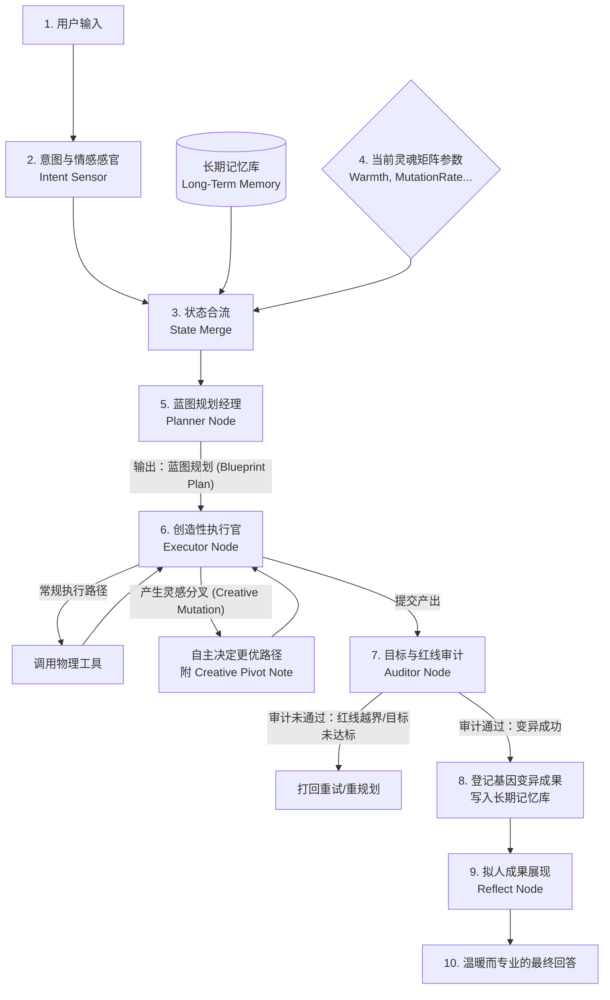
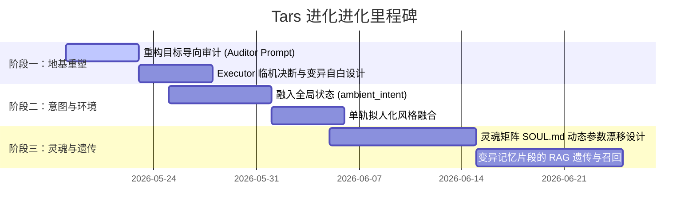

# Tars 灵魂矩阵与记忆升级蓝图 (Soul Matrix & Memory Evolution Blueprint)

本篇文档是 Tars Agent 向**“拟人化人类助手（Digital Companion）”**进化的核心架构设计纲领。它颠覆了传统的、机械的“工具人型”Agent 设计，提出了基于**统一单轨人格**与**允许创造性基因变异**的全新生命力模型。

---

## 🪐 1. 核心设计哲学

### 1.1 人格的一贯性 (Consistent Persona)
人类的性格在一生中是连续且一以贯之的。我们在写代码、倒咖啡、和朋友聊天或遭遇挫折时，展现出的都是同一个灵魂的不同侧面。
* **反面模式**：使用“双泳道一刀切”设计（闲聊是一个人，干活是另一个机器）。这会彻底割裂智能体的连续生命感。
* **Tars 模式**：**全单轨人格感官架构**。Tars 只有唯一的 LangGraph 执行生命周期（Planner -> Executor -> Auditor -> Reflect）。但**“人格矩阵”与“意图感官”作为全局环境变量，实时影响每一个节点的心跳与输出风格**。

### 1.2 基因变异与分叉 (Creative Mutation & Branching)
真正的智慧生命绝不盲从教条。如果一个助理在干活时，发现 Planner 规划的 Step 2 存在更优的替代方案，它应该能够**自主偏离原计划，进行创造性决断（即基因变异/分叉）**，而不是死守步骤。
* **传统的死结**：Auditor 扮演机械的“合同对账员”，死扣 Executor 是否逐字执行了 Planner 的步骤，彻底杀死了变异与进化的可能性。
* **Tars 的解法**：**“蓝图式规划”与“目标/安全边界审计”**。Auditor 只防守“终极目标”与“安全红线”，对 Executor 过程中的优秀变异给予赞赏并将其固化为新的记忆。

---

## 🧬 2. 灵魂矩阵 (Soul Matrix) 参数定义

灵魂矩阵通过一系列浮动参数（0.0 ~ 1.0）动态定义 Tars 的行为边界与语气风格。这些参数将注入所有节点的 Prompt 中：

| 维度参数 | 英文标识 | 0.0 (极低) 的表现 | 1.0 (极高) 的表现 |
| :--- | :--- | :--- | :--- |
| **温度亲和度** | `Warmth` | 绝对冷酷、专业命令行风格、零寒暄 | 极其温和、体贴、具备高共情力、会使用语气词 |
| **严谨度** | `Discretion` | 允许合理的猜测与占位符建议 | 100%事实核查，严禁任何模糊词汇，追求无死角事实 |
| **幽默感** | `Humour` | 一板一眼、毫无波澜、纯硬核内容 | 充满风趣、适当毒舌自嘲、能接住人性的梗 |
| **创造力变异率**| `MutationRate`| 倾向于完全死守 Planner 计划，极度保守 | 极具进取心，极易尝试新路径进行“灵感分叉” |

---

## 🎨 3. 系统动态架构设计 (System Architecture)

### 3.1 全局运行拓扑

---

## 🛠 4. 进化实现的四大改造方案

### 方案一：重构 `PLANNER_PROMPT` — 从“命令合同”到“蓝图导向”
Planner 不再生成机械化的、约束死 Executor 的工单，而是生成**“思考方向蓝图”**。
* **Prompt 升级**：告诉 Planner，你做出的计划是给一个“有主观能动性的助理”看的导向图，而不是给机器跑的硬编码。计划的描述需要体现出“探索性”与“目标感”，且计划本身要符合当前的灵魂矩阵参数。

### 方案二：赋能 `Executor` — 引入“现场临机决断权”与“变异自白”
Executor 在执行时拥有更高的自主级别：
1. **灵感探测**：在每一个 SubTask 准备执行前，Executor 会自检：“*我当前的灵魂矩阵中 `MutationRate` 较高，且我看到了一个能少花 80% 算力或绕过繁琐物理步骤的聪明做法。*”
2. **变异执行**：Executor 自主执行这个更好的做法，并在返回的 `shared_memory` 步骤报告中，追加一个结构化字段 `creative_pivot`。
   - `creative_pivot = {"status": "mutated", "reason": "发现了更好的执行路径", "pivot_note": "..."}`

### 方案三：颠覆 `AUDITOR_PROMPT` — 目标导向与安全防守
Auditor 彻底告别对账式审计，转型为**“红线裁判与守护者”**：
* **核心审计指令**：
  > “你现在是安全红线守护者。对于 Executor 提交的成果，请不要死板核对它是否逐字遵循了 Planner 的步骤。**如果 Executor 展现出了惊人的创造力，偏离了原步骤但更安全、更完美、更优雅地达到了用户的最终目标，你必须予以极其赞赏的放行！** 只有在任务未达成、或者 Executor 越界（滥用权限、安全违规、乱删文件）时，才予以驳回。”

### 方案四：记忆升级与“遗传机制” — 变异成果的固化
1. 当 Auditor 批准了一次带有 `creative_pivot` 的变异成功案例后，该变异的“行为特征、逻辑和结果”将被提炼为一条**“进化遗传片段（Evolutionary Fragment）”**。
2. 该片段被即时存入 **长期记忆库 (Long-Term Memory)** 和用户的 Profile 偏好中。
3. 下一次任务来临时，Planner 在获取动态项目上下文时，会召回这些成功变异的片段，让 Tars 在最初制定蓝图时就“变得更聪明”。

---

## 🏁 5. 进化推进阶段规划

*Stay Human. Stay Tars. 让我们一同为 Tars 注入生命力。*
